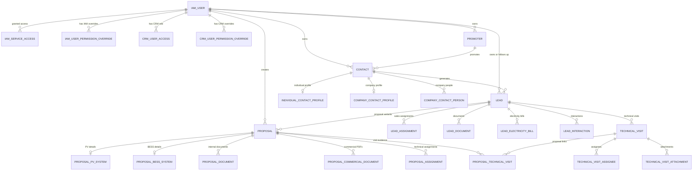

# VenturaDB Data Dictionary

## Purpose

`ventura.db` is the shared VERP development database. IAM and CRM are separate services, but they share this physical database so CRM and future services can reference the same central IAM users.

This document describes the current database schema as a technical reference for developers. It should be updated whenever migrations add, remove, or change tables, columns, constraints, or ownership boundaries.

## Current Schema Snapshot

| Item | Value |
|---|---|
| Local database file | `./ventura.db` |
| Database engine | SQLite for local development |
| Production direction | Shared PostgreSQL database unless a future ADR changes this |
| Application tables including migration tables | 28 |
| CRM Alembic version table | `alembic_version` |
| Current CRM version row | `d9f0c3a2b4e1` |
| IAM Alembic version table | `iam_alembic_version` |
| Current IAM version row | `20260601_0001` |

Foreign keys are declared without cascade actions. Current SQLite metadata reports `NO ACTION` for both update and delete behavior. Application connections enable SQLite foreign key enforcement; external SQLite clients should run `PRAGMA foreign_keys=ON` before manual data changes.

## Ownership Summary

| Service | Tables |
|---|---|
| IAM | `iam_user`, `iam_user_permission_override`, `iam_service_access`, `iam_alembic_version` |
| CRM permissions | `crm_user_access`, `crm_user_permission_override`, `lead_assignment`, `proposal_assignment` |
| CRM contacts | `promoter`, `contact`, `individual_contact_profile`, `company_contact_profile`, `company_contact_person` |
| CRM leads | `lead`, `lead_document`, `lead_electricity_bill`, `lead_interaction` |
| CRM proposals | `proposal`, `proposal_pv_system`, `proposal_bess_system`, `proposal_commercial_document`, `proposal_document` |
| CRM technical visits | `technical_visit`, `technical_visit_assignee`, `technical_visit_attachment`, `proposal_technical_visit` |
| CRM pipeline | `stage_transition` |
| CRM migrations | `alembic_version` |

## Relationship Overview

## Shared Conventions

- Integer primary keys are application record identifiers.
- `created_at`, `updated_at`, `uploaded_at`, `assigned_at`, `transitioned_at`, and related fields use SQLAlchemy `DATETIME` affinity in SQLite.
- `DATE` is used for proposal validity dates.
- Enum-like values are stored as `VARCHAR` values and constrained with `CHECK` constraints where present.
- File tables store metadata and `stored_path`; binary files are stored outside the database.
- IAM-owned tables should be changed through IAM migrations.
- CRM-owned tables should be changed through CRM/root Alembic migrations.

## Migration Tables

### `alembic_version`

Owner: CRM/root Alembic environment.

Purpose: Tracks the applied CRM migration revision in the shared database.

| Column | Type | Required | Key | Description |
|---|---|---:|---|---|
| `version_num` | `VARCHAR(32)` | Yes | PK | Current CRM Alembic revision id. |

Constraints and indexes:

- Primary key: `alembic_version_pkc` on `version_num`.

### `iam_alembic_version`

Owner: IAM Alembic environment.

Purpose: Tracks the applied IAM migration revision in the same physical database without conflicting with CRM migration history.

| Column | Type | Required | Key | Description |
|---|---|---:|---|---|
| `version_num` | `VARCHAR(32)` | Yes | PK | Current IAM Alembic revision id. |

Constraints and indexes:

- Primary key: `iam_alembic_version_pkc` on `version_num`.

## IAM Tables

### `iam_user`

Owner: IAM.

Purpose: Central VERP human user account. CRM and future services reference this table for ownership, assignments, and audit fields, but IAM owns lifecycle and authentication.

| Column | Type | Required | Key | Description |
|---|---|---:|---|---|
| `id` | `INTEGER` | Yes | PK | Stable central user id. |
| `email` | `VARCHAR(255)` | Yes | Unique | Normalized login email. |
| `full_name` | `VARCHAR(255)` | No |  | Display name. |
| `hashed_password` | `VARCHAR` | Yes |  | Password hash; plaintext passwords are never stored. |
| `is_active` | `BOOLEAN` | Yes | Indexed | Whether the account can authenticate and act in services. |
| `created_at` | `DATETIME` | Yes |  | Creation timestamp. |
| `updated_at` | `DATETIME` | Yes |  | Last update timestamp. |

Constraints and indexes:

- Unique index: `ix_iam_user_email` on `email`.
- Index: `ix_iam_user_is_active` on `is_active`.

### `iam_user_permission_override`

Owner: IAM.

Purpose: Explicit IAM permission grant or denial for a central user. IAM permissions authorize IAM actions only.

| Column | Type | Required | Key | Description |
|---|---|---:|---|---|
| `id` | `INTEGER` | Yes | PK | Override id. |
| `user_id` | `INTEGER` | Yes | FK | Target user receiving the grant or denial. References `iam_user.id`. |
| `permission` | `VARCHAR(120)` | Yes | Indexed | IAM permission key such as `iam.users.create`. |
| `effect` | `VARCHAR(5)` | Yes | Check | `GRANT` or `DENY`. |
| `changed_by` | `INTEGER` | No | FK | IAM user who changed the override. References `iam_user.id`. |
| `created_at` | `DATETIME` | Yes |  | Creation timestamp. |
| `updated_at` | `DATETIME` | Yes |  | Last update timestamp. |

Constraints and indexes:

- Check: `effect IN ('GRANT', 'DENY')`.
- Unique constraint: one row per `user_id` and `permission`.
- Foreign keys: `user_id -> iam_user.id`, `changed_by -> iam_user.id`.
- Indexes: `ix_iam_user_permission_override_user_id`, `ix_iam_user_permission_override_permission`, `ix_iam_user_permission_override_changed_by`.

### `iam_service_access`

Owner: IAM.

Purpose: Grants or revokes a central user's access to a VERP service key. The current service catalog contains `crm`.

| Column | Type | Required | Key | Description |
|---|---|---:|---|---|
| `id` | `INTEGER` | Yes | PK | Service-access record id. |
| `user_id` | `INTEGER` | Yes | FK | User receiving service access. References `iam_user.id`. |
| `service_key` | `VARCHAR(80)` | Yes | Indexed | Lowercase VERP service key, currently `crm`. |
| `is_active` | `BOOLEAN` | Yes | Indexed | Active access flag. Revocation sets this false instead of deleting history. |
| `granted_by` | `INTEGER` | Yes | FK | IAM user who granted or reactivated access. References `iam_user.id`. |
| `created_at` | `DATETIME` | Yes |  | Creation timestamp. |
| `updated_at` | `DATETIME` | Yes |  | Last update timestamp. |

Constraints and indexes:

- Unique constraint: one row per `user_id` and `service_key`.
- Foreign keys: `user_id -> iam_user.id`, `granted_by -> iam_user.id`.
- Indexes: `ix_iam_service_access_user_id`, `ix_iam_service_access_service_key`, `ix_iam_service_access_is_active`, `ix_iam_service_access_granted_by`.

## CRM Authorization Tables

### `crm_user_access`

Owner: CRM permissions domain.

Purpose: Stores CRM role and active CRM authorization state for an IAM user. A user also needs active IAM service access for `crm`.

| Column | Type | Required | Key | Description |
|---|---|---:|---|---|
| `user_id` | `INTEGER` | Yes | PK, FK | IAM user id. References `iam_user.id`. |
| `role` | `VARCHAR(7)` | Yes | Check | CRM role template: `ADMIN`, `SALES`, `MANAGER`, or `TECH`. |
| `is_active` | `BOOLEAN` | Yes | Indexed | Whether CRM authorization is active. |
| `changed_by` | `INTEGER` | No | FK | IAM user who changed CRM access. References `iam_user.id`. |
| `created_at` | `DATETIME` | Yes |  | Creation timestamp. |
| `updated_at` | `DATETIME` | Yes |  | Last update timestamp. |

Constraints and indexes:

- Check: `role IN ('ADMIN', 'SALES', 'MANAGER', 'TECH')`.
- Foreign keys: `user_id -> iam_user.id`, `changed_by -> iam_user.id`.
- Indexes: `ix_crm_user_access_is_active`, `ix_crm_user_access_changed_by`.

### `crm_user_permission_override`

Owner: CRM permissions domain.

Purpose: Explicit CRM permission grant or denial for an IAM user. CRM permissions authorize CRM actions only.

| Column | Type | Required | Key | Description |
|---|---|---:|---|---|
| `id` | `INTEGER` | Yes | PK | Override id. |
| `user_id` | `INTEGER` | Yes | FK | Target IAM user. References `iam_user.id`. |
| `permission` | `VARCHAR(120)` | Yes | Indexed | CRM permission key such as `crm.leads.read`. |
| `effect` | `VARCHAR(5)` | Yes | Check | `GRANT` or `DENY`. |
| `changed_by` | `INTEGER` | No | FK | IAM user who changed the override. References `iam_user.id`. |
| `created_at` | `DATETIME` | Yes |  | Creation timestamp. |
| `updated_at` | `DATETIME` | Yes |  | Last update timestamp. |

Constraints and indexes:

- Check: `effect IN ('GRANT', 'DENY')`.
- Unique constraint: one row per `user_id` and `permission`.
- Foreign keys: `user_id -> iam_user.id`, `changed_by -> iam_user.id`.
- Indexes: `ix_crm_user_permission_override_user_id`, `ix_crm_user_permission_override_permission`, `ix_crm_user_permission_override_changed_by`.

### `lead_assignment`

Owner: CRM permissions domain.

Purpose: Sales follow-up assignment history for Leads. The active assignment drives `SALES` scope over a Lead and derived records.

| Column | Type | Required | Key | Description |
|---|---|---:|---|---|
| `id` | `INTEGER` | Yes | PK | Assignment id. |
| `lead_id` | `INTEGER` | Yes | FK | Assigned Lead. References `lead.id`. |
| `user_id` | `INTEGER` | Yes | FK | Sales user assigned to follow up. References `iam_user.id`. |
| `assigned_by` | `INTEGER` | Yes | FK | IAM user who assigned or transferred follow-up. References `iam_user.id`. |
| `is_active` | `BOOLEAN` | Yes | Indexed | Current active assignment flag. |
| `assigned_at` | `DATETIME` | Yes | Indexed | Assignment timestamp. |
| `unassigned_at` | `DATETIME` | No |  | Timestamp when this assignment stopped being active. |

Constraints and indexes:

- Partial unique index: `uq_lead_assignment_one_active` on `lead_id` where `is_active = 1`.
- Foreign keys: `lead_id -> lead.id`, `user_id -> iam_user.id`, `assigned_by -> iam_user.id`.
- Indexes: `ix_lead_assignment_lead_id`, `ix_lead_assignment_user_id`, `ix_lead_assignment_assigned_by`, `ix_lead_assignment_is_active`, `ix_lead_assignment_user_active`.

### `proposal_assignment`

Owner: CRM permissions domain.

Purpose: Technical assignment history for Proposal work. Active assignments drive `TECH` scope over assigned Proposals.

| Column | Type | Required | Key | Description |
|---|---|---:|---|---|
| `id` | `INTEGER` | Yes | PK | Assignment id. |
| `proposal_id` | `INTEGER` | Yes | FK | Assigned Proposal. References `proposal.id`. |
| `user_id` | `INTEGER` | Yes | FK | Technical user assigned to the Proposal. References `iam_user.id`. |
| `assigned_by` | `INTEGER` | Yes | FK | IAM user who assigned the work. References `iam_user.id`. |
| `is_active` | `BOOLEAN` | Yes | Indexed | Current active assignment flag. |
| `assigned_at` | `DATETIME` | Yes | Indexed | Assignment timestamp. |
| `unassigned_at` | `DATETIME` | No |  | Timestamp when this assignment stopped being active. |

Constraints and indexes:

- Partial unique index: `uq_proposal_assignment_active_user` on `proposal_id, user_id` where `is_active = 1`.
- Foreign keys: `proposal_id -> proposal.id`, `user_id -> iam_user.id`, `assigned_by -> iam_user.id`.
- Indexes: `ix_proposal_assignment_proposal_id`, `ix_proposal_assignment_user_id`, `ix_proposal_assignment_assigned_by`, `ix_proposal_assignment_is_active`, `ix_proposal_assignment_user_active`.

## CRM Contacts Tables

### `promoter`

Owner: CRM contacts domain.

Purpose: Owner-scoped catalog of people who promote or refer Contacts. Every Contact references a Promoter.

| Column | Type | Required | Key | Description |
|---|---|---:|---|---|
| `id` | `INTEGER` | Yes | PK | Promoter id. |
| `name` | `VARCHAR(255)` | Yes | Indexed | Promoter name. |
| `phone` | `VARCHAR(50)` | Yes |  | Promoter phone number. |
| `owner_id` | `INTEGER` | Yes | FK | IAM user who owns the promoter catalog entry. References `iam_user.id`. |
| `created_at` | `DATETIME` | Yes |  | Creation timestamp. |
| `updated_at` | `DATETIME` | Yes |  | Last update timestamp. |

Constraints and indexes:

- Foreign key: `owner_id -> iam_user.id`.
- Indexes: `ix_promoter_name`, `ix_promoter_owner_id`.

### `contact`

Owner: CRM contacts domain.

Purpose: Durable identity record for a person or organization. Contacts answer "who they are" and can generate multiple Leads over time.

| Column | Type | Required | Key | Description |
|---|---|---:|---|---|
| `id` | `INTEGER` | Yes | PK | Contact id. |
| `type` | `VARCHAR(10)` | Yes | Check, indexed | Contact type: `INDIVIDUAL` or `COMPANY`. |
| `name` | `VARCHAR(255)` | Yes | Indexed | Full person name or company name. |
| `address_line` | `VARCHAR(255)` | No |  | Street/address line. |
| `city` | `VARCHAR(120)` | No |  | City. |
| `state` | `VARCHAR(120)` | No |  | State or region. |
| `postal_code` | `VARCHAR(30)` | No |  | Postal code. |
| `promoter_id` | `INTEGER` | Yes | FK, indexed | Promoter that sourced the contact. References `promoter.id`. |
| `owner_id` | `INTEGER` | Yes | FK, indexed | IAM user that owns the contact. References `iam_user.id`. |
| `created_at` | `DATETIME` | Yes |  | Creation timestamp. |
| `updated_at` | `DATETIME` | Yes |  | Last update timestamp. |

Constraints and indexes:

- Check: `type IN ('INDIVIDUAL', 'COMPANY')`.
- Foreign keys: `promoter_id -> promoter.id`, `owner_id -> iam_user.id`.
- Indexes: `ix_contact_type`, `ix_contact_name`, `ix_contact_promoter_id`, `ix_contact_owner_id`.

### `individual_contact_profile`

Owner: CRM contacts domain.

Purpose: One-to-one extension table for individual-only Contact fields.

| Column | Type | Required | Key | Description |
|---|---|---:|---|---|
| `id` | `INTEGER` | Yes | PK | Individual profile id. |
| `contact_id` | `INTEGER` | Yes | FK, unique | Related individual Contact. References `contact.id`. |
| `email` | `VARCHAR(255)` | No | Indexed | Individual contact email. |
| `phone` | `VARCHAR(50)` | No |  | Individual contact phone. |

Constraints and indexes:

- Unique index: `ix_individual_contact_profile_contact_id` on `contact_id`.
- Foreign key: `contact_id -> contact.id`.
- Index: `ix_individual_contact_profile_email`.

### `company_contact_profile`

Owner: CRM contacts domain.

Purpose: One-to-one extension table for company-only Contact fields.

| Column | Type | Required | Key | Description |
|---|---|---:|---|---|
| `id` | `INTEGER` | Yes | PK | Company profile id. |
| `contact_id` | `INTEGER` | Yes | FK, unique | Related company Contact. References `contact.id`. |
| `industry` | `VARCHAR(120)` | No |  | Company industry or market segment. |

Constraints and indexes:

- Unique index: `ix_company_contact_profile_contact_id` on `contact_id`.
- Foreign key: `contact_id -> contact.id`.

### `company_contact_person`

Owner: CRM contacts domain.

Purpose: Person inside a company Contact. Company representatives are not modeled as independent Contact rows.

| Column | Type | Required | Key | Description |
|---|---|---:|---|---|
| `id` | `INTEGER` | Yes | PK | Company person id. |
| `company_contact_id` | `INTEGER` | Yes | FK, indexed | Company Contact represented by this person. References `contact.id`. |
| `name` | `VARCHAR(255)` | Yes | Indexed | Representative name. |
| `phone` | `VARCHAR(50)` | Yes |  | Representative phone. |
| `email` | `VARCHAR(255)` | No | Indexed | Representative email. |
| `position` | `VARCHAR(120)` | Yes |  | Job title or role at the company. |
| `created_at` | `DATETIME` | Yes |  | Creation timestamp. |
| `updated_at` | `DATETIME` | Yes |  | Last update timestamp. |

Constraints and indexes:

- Foreign key: `company_contact_id -> contact.id`.
- Indexes: `ix_company_contact_person_company_contact_id`, `ix_company_contact_person_name`, `ix_company_contact_person_email`.
- Business invariant enforced by the service layer: company contacts must have at least one company person.

## CRM Leads Tables

### `lead`

Owner: CRM leads domain.

Purpose: Bounded sales opportunity linked to one primary Contact. Leads answer "what we want to sell them."

| Column | Type | Required | Key | Description |
|---|---|---:|---|---|
| `id` | `INTEGER` | Yes | PK | Lead id. |
| `contact_id` | `INTEGER` | Yes | FK, indexed | Primary Contact for the opportunity. References `contact.id`. |
| `title` | `VARCHAR(255)` | Yes | Indexed | Human-readable opportunity title. |
| `interest_type` | `VARCHAR(12)` | Yes | Check | `PHOTOVOLTAIC`, `BESS`, or `HIBRID`. |
| `qualification_score` | `INTEGER` | No | Check | Optional score from 0 to 100. |
| `current_stage` | `VARCHAR(14)` | Yes | Check, indexed | `NEW`, `QUALIFYING`, `PROPOSAL_PHASE`, `CLOSED_WON`, or `CLOSED_LOST`. |
| `outcome` | `VARCHAR(4)` | No | Check, indexed | Terminal outcome: `WON` or `LOST`. Null while open. |
| `owner_id` | `INTEGER` | Yes | FK, indexed | IAM user currently responsible for sales follow-up. References `iam_user.id`. |
| `notes` | `VARCHAR(4000)` | No |  | Free-form lead notes. |
| `technical_visit_requirement` | `VARCHAR(12)` | Yes | Check, indexed | `UNDETERMINED`, `NOT_REQUIRED`, or `REQUIRED`. |
| `created_at` | `DATETIME` | Yes | Indexed in composite | Creation timestamp. |
| `closed_at` | `DATETIME` | No |  | Close timestamp. |

Constraints and indexes:

- Check: `interest_type IN ('PHOTOVOLTAIC', 'BESS', 'HIBRID')`.
- Check: `current_stage IN ('NEW', 'QUALIFYING', 'PROPOSAL_PHASE', 'CLOSED_WON', 'CLOSED_LOST')`.
- Check: `outcome IS NULL OR outcome IN ('WON', 'LOST')`.
- Check: `qualification_score IS NULL OR (qualification_score >= 0 AND qualification_score <= 100)`.
- Check: `technical_visit_requirement IN ('UNDETERMINED', 'NOT_REQUIRED', 'REQUIRED')`.
- Foreign keys: `contact_id -> contact.id`, `owner_id -> iam_user.id`.
- Indexes: `ix_lead_contact_id`, `ix_lead_title`, `ix_lead_current_stage`, `ix_lead_outcome`, `ix_lead_owner_id`, `ix_lead_technical_visit_requirement`, `ix_lead_owner_stage_created`.

### `lead_document`

Owner: CRM leads domain.

Purpose: Metadata for general Lead project documents such as plans, requirements, or customer-provided specifications.

| Column | Type | Required | Key | Description |
|---|---|---:|---|---|
| `id` | `INTEGER` | Yes | PK | Document metadata id. |
| `lead_id` | `INTEGER` | Yes | FK, indexed | Related Lead. References `lead.id`. |
| `title` | `VARCHAR(255)` | Yes | Indexed | Human title supplied for the document. |
| `original_filename` | `VARCHAR(255)` | Yes |  | Filename supplied by the uploader. |
| `content_type` | `VARCHAR(120)` | No |  | MIME/content type if known. |
| `stored_path` | `VARCHAR(500)` | Yes |  | Filesystem path or storage key for the uploaded file. |
| `size_bytes` | `INTEGER` | Yes | Check | File size in bytes; must be positive. |
| `uploaded_by` | `INTEGER` | Yes | FK, indexed | IAM user who uploaded the file. References `iam_user.id`. |
| `uploaded_at` | `DATETIME` | Yes | Indexed in composite | Upload timestamp. |

Constraints and indexes:

- Check: `size_bytes > 0`.
- Foreign keys: `lead_id -> lead.id`, `uploaded_by -> iam_user.id`.
- Indexes: `ix_lead_document_lead_id`, `ix_lead_document_title`, `ix_lead_document_uploaded_by`, `ix_lead_document_lead_uploaded`.

### `lead_electricity_bill`

Owner: CRM leads domain.

Purpose: Metadata for Lead electricity bills. Bills are separate from general documents because they feed an independent review process.

| Column | Type | Required | Key | Description |
|---|---|---:|---|---|
| `id` | `INTEGER` | Yes | PK | Electricity bill metadata id. |
| `lead_id` | `INTEGER` | Yes | FK, indexed | Related Lead. References `lead.id`. |
| `title` | `VARCHAR(255)` | Yes | Indexed | Human title supplied for the bill. |
| `original_filename` | `VARCHAR(255)` | Yes |  | Filename supplied by the uploader. |
| `content_type` | `VARCHAR(120)` | No |  | MIME/content type if known. |
| `stored_path` | `VARCHAR(500)` | Yes |  | Filesystem path or storage key for the uploaded file. |
| `size_bytes` | `INTEGER` | Yes | Check | File size in bytes; must be positive. |
| `uploaded_by` | `INTEGER` | Yes | FK, indexed | IAM user who uploaded the file. References `iam_user.id`. |
| `uploaded_at` | `DATETIME` | Yes | Indexed in composite | Upload timestamp. |

Constraints and indexes:

- Check: `size_bytes > 0`.
- Foreign keys: `lead_id -> lead.id`, `uploaded_by -> iam_user.id`.
- Indexes: `ix_lead_electricity_bill_lead_id`, `ix_lead_electricity_bill_title`, `ix_lead_electricity_bill_uploaded_by`, `ix_lead_electricity_bill_lead_uploaded`.

### `lead_interaction`

Owner: CRM leads domain.

Purpose: Sales interactions, negotiation notes, and planned or historical follow-up events for a Lead.

| Column | Type | Required | Key | Description |
|---|---|---:|---|---|
| `id` | `INTEGER` | Yes | PK | Interaction id. |
| `lead_id` | `INTEGER` | Yes | FK, indexed | Related Lead. References `lead.id`. |
| `interaction_type` | `VARCHAR(11)` | Yes | Check, indexed | `CALL`, `EMAIL`, `MEETING`, `MESSAGE`, `NEGOTIATION`, or `NOTE`. |
| `title` | `VARCHAR(255)` | Yes | Indexed | Short interaction title. |
| `notes` | `VARCHAR(4000)` | Yes |  | Interaction details. |
| `interaction_date` | `DATETIME` | Yes | Indexed | Date/time of the interaction or planned follow-up. |
| `created_by` | `INTEGER` | Yes | FK, indexed | IAM user who created the record. References `iam_user.id`. |
| `created_at` | `DATETIME` | Yes |  | Creation timestamp. |
| `updated_at` | `DATETIME` | Yes |  | Last update timestamp. |

Constraints and indexes:

- Check: `interaction_type IN ('CALL', 'EMAIL', 'MEETING', 'MESSAGE', 'NEGOTIATION', 'NOTE')`.
- Foreign keys: `lead_id -> lead.id`, `created_by -> iam_user.id`.
- Indexes: `ix_lead_interaction_lead_id`, `ix_lead_interaction_interaction_type`, `ix_lead_interaction_interaction_date`, `ix_lead_interaction_title`, `ix_lead_interaction_created_by`, `ix_lead_interaction_lead_date`.

## CRM Proposal Tables

### `proposal`

Owner: CRM proposals domain.

Purpose: Common commercial header for a concrete technical proposal variant. A Lead can have multiple Proposals.

| Column | Type | Required | Key | Description |
|---|---|---:|---|---|
| `id` | `INTEGER` | Yes | PK | Proposal id. |
| `lead_id` | `INTEGER` | Yes | FK, indexed | Parent Lead. References `lead.id`. |
| `name` | `VARCHAR(255)` | Yes | Indexed | Proposal name or variant label. |
| `version` | `VARCHAR(50)` | No |  | Version label. |
| `installation_address_line` | `VARCHAR(500)` | No |  | Installation street/address line. |
| `installation_city` | `VARCHAR(120)` | No |  | Installation city. |
| `installation_state` | `VARCHAR(120)` | No |  | Installation state or region. |
| `installation_postal_code` | `VARCHAR(30)` | No |  | Installation postal code. |
| `tariff` | `VARCHAR(120)` | No |  | Utility tariff or rate category. |
| `contracted_demand` | `FLOAT` | No | Check | Contracted demand; must be positive when present. |
| `system_type` | `VARCHAR(6)` | No | Check, indexed | `PV`, `BESS`, or `HIBRID`. |
| `total_price` | `NUMERIC(14, 2)` | No | Check | Total sales price; must be positive when present. |
| `annual_savings` | `NUMERIC(14, 2)` | No | Check | Estimated annual savings; must be nonnegative when present. |
| `currency` | `VARCHAR(3)` | No | Check | Three-character currency code. |
| `estimated_cost` | `NUMERIC(14, 2)` | No | Check | Estimated cost; must be nonnegative when present. |
| `expected_profit` | `NUMERIC(14, 2)` | No | Check | Expected profit; must be nonnegative when present. |
| `submitted_at` | `DATETIME` | No | Indexed | Date/time submitted or sent. |
| `valid_until` | `DATE` | No | Indexed | Proposal validity date. |
| `current_stage` | `VARCHAR(11)` | Yes | Check, indexed | `DRAFT`, `SENT`, `NEGOTIATION`, `WON`, `LOST`, or `SUPERSEDED`. |
| `loss_reason` | `VARCHAR(500)` | No | Check | Required when `current_stage = 'LOST'`. |
| `proposed_at` | `DATETIME` | No |  | First time the proposal entered `SENT`. |
| `created_by` | `INTEGER` | Yes | FK, indexed | IAM user who created the Proposal. References `iam_user.id`. |
| `created_at` | `DATETIME` | Yes | Indexed in composite | Creation timestamp. |

Constraints and indexes:

- Check: `system_type IS NULL OR system_type IN ('PV', 'BESS', 'HIBRID')`.
- Check: `current_stage IN ('DRAFT', 'SENT', 'NEGOTIATION', 'WON', 'LOST', 'SUPERSEDED')`.
- Check: `current_stage != 'LOST' OR (loss_reason IS NOT NULL AND length(trim(loss_reason)) > 0)`.
- Check: `currency IS NULL OR length(currency) = 3`.
- Check: `contracted_demand IS NULL OR contracted_demand > 0`.
- Check: `total_price IS NULL OR total_price > 0`.
- Check: `annual_savings IS NULL OR annual_savings >= 0`.
- Check: `estimated_cost IS NULL OR estimated_cost >= 0`.
- Check: `expected_profit IS NULL OR expected_profit >= 0`.
- Partial unique index: `uq_proposal_one_won_per_lead` on `lead_id` where `current_stage = 'WON'`.
- Foreign keys: `lead_id -> lead.id`, `created_by -> iam_user.id`.
- Indexes: `ix_proposal_lead_id`, `ix_proposal_name`, `ix_proposal_current_stage`, `ix_proposal_system_type`, `ix_proposal_created_by`, `ix_proposal_submitted_at`, `ix_proposal_valid_until`, `ix_proposal_lead_stage`, `ix_proposal_user_stage_created`.

### `proposal_pv_system`

Owner: CRM proposals domain.

Purpose: One-to-one PV technical and unit-economics detail row for `PV` and `HIBRID` Proposals.

| Column | Type | Required | Key | Description |
|---|---|---:|---|---|
| `id` | `INTEGER` | Yes | PK | PV detail id. |
| `proposal_id` | `INTEGER` | Yes | FK, unique | Related Proposal. References `proposal.id`. |
| `panel_count` | `INTEGER` | No | Check | Number of panels; nonnegative when present. |
| `panel_model` | `VARCHAR(255)` | No |  | Panel model. |
| `panel_power` | `FLOAT` | No | Check | Panel power; positive when present. |
| `inverter_model` | `VARCHAR(255)` | No |  | Inverter model. |
| `inverter_count` | `INTEGER` | No | Check | Number of inverters; nonnegative when present. |
| `inverter_power` | `FLOAT` | No | Check | Inverter power; positive when present. |
| `type_of_surface` | `VARCHAR(120)` | No |  | Installation surface type. |
| `total_power_ac` | `FLOAT` | No | Check | Total AC power; positive when present. |
| `system_size_kw` | `FLOAT` | No | Check | PV system size in kW; positive when present. |
| `oversizing_kw` | `FLOAT` | No | Check | Oversizing value in kW; nonnegative when present. |
| `estimated_annual_kwh` | `FLOAT` | No | Check | Estimated annual production; positive when present. |
| `estimated_savings_kw` | `FLOAT` | No | Check | Estimated savings field; nonnegative when present. |
| `connection_mode` | `VARCHAR(120)` | No |  | Interconnection or operating mode. |
| `cost_watt` | `NUMERIC(14, 4)` | No | Check | PV cost per watt; nonnegative when present. |
| `price_watt` | `NUMERIC(14, 4)` | No | Check | PV sale price per watt; positive when present. |

Constraints and indexes:

- Unique index: `ix_proposal_pv_system_proposal_id` on `proposal_id`.
- Foreign key: `proposal_id -> proposal.id`.
- Checks enforce positive or nonnegative numeric values as listed above.

### `proposal_bess_system`

Owner: CRM proposals domain.

Purpose: One-to-one BESS technical and unit-economics detail row for `BESS` and `HIBRID` Proposals.

| Column | Type | Required | Key | Description |
|---|---|---:|---|---|
| `id` | `INTEGER` | Yes | PK | BESS detail id. |
| `proposal_id` | `INTEGER` | Yes | FK, unique | Related Proposal. References `proposal.id`. |
| `battery_model` | `VARCHAR(255)` | No |  | Battery model. |
| `battery_count` | `INTEGER` | No | Check | Number of batteries; nonnegative when present. |
| `battery_power_kw` | `FLOAT` | No | Check | Battery power in kW; positive when present. |
| `battery_storage_kwh` | `FLOAT` | No | Check | Battery storage capacity in kWh; positive when present. |
| `bess_primary_use` | `VARCHAR(120)` | No |  | Primary use such as backup or peak shaving. |
| `technical_notes` | `VARCHAR(4000)` | No |  | Technical notes for the BESS design. |
| `cost_kwh` | `NUMERIC(14, 4)` | No | Check | BESS cost per kWh; nonnegative when present. |
| `price_kwh` | `NUMERIC(14, 4)` | No | Check | BESS sale price per kWh; positive when present. |

Constraints and indexes:

- Unique index: `ix_proposal_bess_system_proposal_id` on `proposal_id`.
- Foreign key: `proposal_id -> proposal.id`.
- Checks enforce positive or nonnegative numeric values as listed above.

### `proposal_commercial_document`

Owner: CRM proposals domain.

Purpose: Metadata for customer-facing commercial proposal PDFs.

| Column | Type | Required | Key | Description |
|---|---|---:|---|---|
| `id` | `INTEGER` | Yes | PK | Commercial document metadata id. |
| `proposal_id` | `INTEGER` | Yes | FK, indexed | Related Proposal. References `proposal.id`. |
| `title` | `VARCHAR(255)` | Yes | Indexed | Human title for the commercial PDF. |
| `original_filename` | `VARCHAR(255)` | Yes |  | Filename supplied by the uploader. |
| `content_type` | `VARCHAR(120)` | No |  | MIME/content type if known. |
| `stored_path` | `VARCHAR(500)` | Yes |  | Filesystem path or storage key for the uploaded file. |
| `size_bytes` | `INTEGER` | Yes | Check | File size in bytes; must be positive. |
| `uploaded_by` | `INTEGER` | Yes | FK, indexed | IAM user who uploaded the file. References `iam_user.id`. |
| `uploaded_at` | `DATETIME` | Yes | Indexed in composite | Upload timestamp. |

Constraints and indexes:

- Check: `size_bytes > 0`.
- Foreign keys: `proposal_id -> proposal.id`, `uploaded_by -> iam_user.id`.
- Indexes: `ix_proposal_commercial_document_proposal_id`, `ix_proposal_commercial_document_title`, `ix_proposal_commercial_document_uploaded_by`, `ix_proposal_commercial_document_proposal_uploaded`.

### `proposal_document`

Owner: CRM proposals domain.

Purpose: Metadata for internal Proposal documents classified as cost, technical, or other material.

| Column | Type | Required | Key | Description |
|---|---|---:|---|---|
| `id` | `INTEGER` | Yes | PK | Proposal document metadata id. |
| `proposal_id` | `INTEGER` | Yes | FK, indexed | Related Proposal. References `proposal.id`. |
| `title` | `VARCHAR(255)` | Yes | Indexed | Human title for the document. |
| `classification` | `VARCHAR(9)` | Yes | Check, indexed | `COSTS`, `TECHNICAL`, or `OTHER`. |
| `original_filename` | `VARCHAR(255)` | Yes |  | Filename supplied by the uploader. |
| `content_type` | `VARCHAR(120)` | No |  | MIME/content type if known. |
| `stored_path` | `VARCHAR(500)` | Yes |  | Filesystem path or storage key for the uploaded file. |
| `size_bytes` | `INTEGER` | Yes | Check | File size in bytes; must be positive. |
| `uploaded_by` | `INTEGER` | Yes | FK, indexed | IAM user who uploaded the file. References `iam_user.id`. |
| `uploaded_at` | `DATETIME` | Yes | Indexed in composite | Upload timestamp. |

Constraints and indexes:

- Check: `classification IN ('COSTS', 'TECHNICAL', 'OTHER')`.
- Check: `size_bytes > 0`.
- Foreign keys: `proposal_id -> proposal.id`, `uploaded_by -> iam_user.id`.
- Indexes: `ix_proposal_document_proposal_id`, `ix_proposal_document_title`, `ix_proposal_document_classification`, `ix_proposal_document_uploaded_by`, `ix_proposal_document_proposal_uploaded`.

## CRM Technical Visit Tables

### `technical_visit`

Owner: CRM technical visits domain.

Purpose: Lead-scoped technical visit header for on-site engineering inspection.

| Column | Type | Required | Key | Description |
|---|---|---:|---|---|
| `id` | `INTEGER` | Yes | PK | Technical visit id. |
| `lead_id` | `INTEGER` | Yes | FK, indexed | Parent Lead. References `lead.id`. |
| `status` | `VARCHAR(9)` | Yes | Check, indexed | `REQUESTED`, `SCHEDULED`, `COMPLETED`, or `CANCELLED`. |
| `scheduled_at` | `DATETIME` | No | Indexed | Scheduled visit date/time. |
| `receiver_name` | `VARCHAR(255)` | No |  | Customer-side receiver name. |
| `receiver_phone` | `VARCHAR(50)` | No |  | Customer-side receiver phone. |
| `notes` | `VARCHAR(4000)` | No |  | Visit notes. |
| `created_by` | `INTEGER` | Yes | FK, indexed | IAM user who created the visit. References `iam_user.id`. |
| `created_at` | `DATETIME` | Yes |  | Creation timestamp. |
| `updated_at` | `DATETIME` | Yes |  | Last update timestamp. |
| `completed_at` | `DATETIME` | No | Check | Required when status is `COMPLETED`. |
| `cancelled_at` | `DATETIME` | No | Check | Required when status is `CANCELLED`. |
| `cancellation_reason` | `VARCHAR(500)` | No |  | Optional cancellation reason. |

Constraints and indexes:

- Check: `status IN ('REQUESTED', 'SCHEDULED', 'COMPLETED', 'CANCELLED')`.
- Check: `status != 'COMPLETED' OR completed_at IS NOT NULL`.
- Check: `status != 'CANCELLED' OR cancelled_at IS NOT NULL`.
- Foreign keys: `lead_id -> lead.id`, `created_by -> iam_user.id`.
- Indexes: `ix_technical_visit_lead_id`, `ix_technical_visit_status`, `ix_technical_visit_scheduled_at`, `ix_technical_visit_created_by`, `ix_technical_visit_lead_status_scheduled`.

### `technical_visit_assignee`

Owner: CRM technical visits domain.

Purpose: Engineer or visitor assigned to a TechnicalVisit. When `user_id` is present, it grants technical-user scope over that visit.

| Column | Type | Required | Key | Description |
|---|---|---:|---|---|
| `id` | `INTEGER` | Yes | PK | Assignee id. |
| `visit_id` | `INTEGER` | Yes | FK, indexed | Related TechnicalVisit. References `technical_visit.id`. |
| `name` | `VARCHAR(255)` | Yes | Indexed | Assignee display name. |
| `user_id` | `INTEGER` | No | FK, indexed | Internal IAM user if the assignee is a system user. References `iam_user.id`. |
| `created_at` | `DATETIME` | Yes |  | Creation timestamp. |

Constraints and indexes:

- Foreign keys: `visit_id -> technical_visit.id`, `user_id -> iam_user.id`.
- Indexes: `ix_technical_visit_assignee_visit_id`, `ix_technical_visit_assignee_user_id`, `ix_technical_visit_assignee_name`.

### `technical_visit_attachment`

Owner: CRM technical visits domain.

Purpose: Metadata for TechnicalVisit evidence files such as documents and photos.

| Column | Type | Required | Key | Description |
|---|---|---:|---|---|
| `id` | `INTEGER` | Yes | PK | Attachment metadata id. |
| `visit_id` | `INTEGER` | Yes | FK, indexed | Related TechnicalVisit. References `technical_visit.id`. |
| `title` | `VARCHAR(255)` | Yes | Indexed | Human title for the attachment. |
| `file_kind` | `VARCHAR(8)` | Yes | Check, indexed | `DOCUMENT`, `PHOTO`, or `OTHER`. |
| `original_filename` | `VARCHAR(255)` | Yes |  | Filename supplied by the uploader. |
| `content_type` | `VARCHAR(120)` | No |  | MIME/content type if known. |
| `stored_path` | `VARCHAR(500)` | Yes |  | Filesystem path or storage key for the uploaded file. |
| `size_bytes` | `INTEGER` | Yes | Check | File size in bytes; must be positive. |
| `uploaded_by` | `INTEGER` | Yes | FK, indexed | IAM user who uploaded the file. References `iam_user.id`. |
| `uploaded_at` | `DATETIME` | Yes | Indexed in composite | Upload timestamp. |

Constraints and indexes:

- Check: `file_kind IN ('DOCUMENT', 'PHOTO', 'OTHER')`.
- Check: `size_bytes > 0`.
- Foreign keys: `visit_id -> technical_visit.id`, `uploaded_by -> iam_user.id`.
- Indexes: `ix_technical_visit_attachment_visit_id`, `ix_technical_visit_attachment_title`, `ix_technical_visit_attachment_file_kind`, `ix_technical_visit_attachment_uploaded_by`, `ix_technical_visit_attachment_visit_uploaded`.

### `proposal_technical_visit`

Owner: CRM technical visits domain.

Purpose: Many-to-many link between a Proposal and the TechnicalVisit evidence it is based on or validated by.

| Column | Type | Required | Key | Description |
|---|---|---:|---|---|
| `id` | `INTEGER` | Yes | PK | Link id. |
| `proposal_id` | `INTEGER` | Yes | FK, indexed | Related Proposal. References `proposal.id`. |
| `technical_visit_id` | `INTEGER` | Yes | FK, indexed | Related TechnicalVisit. References `technical_visit.id`. |
| `relationship_type` | `VARCHAR(12)` | Yes | Check, indexed | `BASED_ON` or `VALIDATED_BY`. |
| `notes` | `VARCHAR(1000)` | No |  | Optional relationship notes. |
| `linked_by` | `INTEGER` | Yes | FK, indexed | IAM user who created the link. References `iam_user.id`. |
| `linked_at` | `DATETIME` | Yes | Indexed in composite | Link timestamp. |

Constraints and indexes:

- Check: `relationship_type IN ('BASED_ON', 'VALIDATED_BY')`.
- Unique constraint: one row per `proposal_id` and `technical_visit_id`.
- Foreign keys: `proposal_id -> proposal.id`, `technical_visit_id -> technical_visit.id`, `linked_by -> iam_user.id`.
- Indexes: `ix_proposal_technical_visit_proposal_id`, `ix_proposal_technical_visit_technical_visit_id`, `ix_proposal_technical_visit_relationship_type`, `ix_proposal_technical_visit_linked_by`, `ix_proposal_technical_visit_proposal_linked`.
- Business invariant enforced by the service layer: Proposal and TechnicalVisit must belong to the same Lead.

## CRM Pipeline Tables

### `stage_transition`

Owner: CRM pipeline domain.

Purpose: Immutable audit history for Lead and Proposal stage changes.

| Column | Type | Required | Key | Description |
|---|---|---:|---|---|
| `id` | `INTEGER` | Yes | PK | Transition id. |
| `entity_type` | `VARCHAR(8)` | Yes | Check, indexed | `LEAD` or `PROPOSAL`. |
| `entity_id` | `INTEGER` | Yes | Indexed | Id of the Lead or Proposal whose stage changed. No direct foreign key because the target table depends on `entity_type`. |
| `from_stage` | `VARCHAR(80)` | No |  | Previous stage. Null for initial transition. |
| `to_stage` | `VARCHAR(80)` | Yes |  | New stage. |
| `transitioned_by` | `INTEGER` | Yes | FK, indexed | IAM user who performed the transition. References `iam_user.id`. |
| `transitioned_at` | `DATETIME` | Yes | Indexed | Transition timestamp. |
| `reason` | `VARCHAR(255)` | No |  | Optional short reason. |
| `notes` | `VARCHAR(4000)` | No |  | Optional longer notes. |

Constraints and indexes:

- Check: `entity_type IN ('LEAD', 'PROPOSAL')`.
- Foreign key: `transitioned_by -> iam_user.id`.
- Indexes: `ix_stage_transition_entity_type`, `ix_stage_transition_entity_id`, `ix_stage_transition_transitioned_by`, `ix_stage_transition_transitioned_at`, `ix_stage_transition_entity_time`, `ix_stage_transition_user_time`.
- Business invariant enforced by the service layer: rows are append-only transition audit entries.

## Cross-Table Business Invariants

The database enforces many structural constraints, but several important rules live in service logic:

- The first IAM user bootstrap rule grants explicit IAM permissions when no users exist.
- CRM authority requires both active IAM service access for `crm` and active CRM access.
- CRM role permissions are code-defined templates; database rows store user role and overrides.
- Users cannot grant IAM or CRM permissions they do not effectively have.
- Users cannot modify their own IAM or CRM permissions.
- Company Contacts must have at least one `company_contact_person`.
- A Lead can close as won through Proposal outcome flow; direct manual close is for lost/abandoned cases.
- A Proposal must be complete before leaving `DRAFT`.
- Winning one Proposal supersedes active sibling Proposals and closes the Lead as won.
- Losing the last active Proposal closes the Lead as lost.
- Proposal protected price fields require price-specific CRM permissions.
- TechnicalVisits are Lead-scoped; Proposal-to-visit links must stay within the same Lead.
- Completed or cancelled TechnicalVisits cannot be modified.
- Pipeline transition history is append-only.

## Index Notes

Most indexes support common ownership, assignment, listing, and audit queries:

- Owner and role filters: `owner_id`, `created_by`, `is_active`, `role`.
- Entity lookups: `contact_id`, `lead_id`, `proposal_id`, `visit_id`.
- Stage and status filters: `current_stage`, `status`, `outcome`.
- Timeline queries: composite indexes ending in `created_at`, `uploaded_at`, `transitioned_at`, or `assigned_at`.
- Partial uniqueness: one active Lead assignment per Lead, one active Proposal assignment per Proposal/User pair, and one won Proposal per Lead.

When adding new high-volume queries, prefer documenting the expected access pattern before adding an index.
