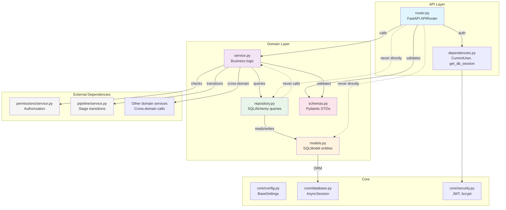
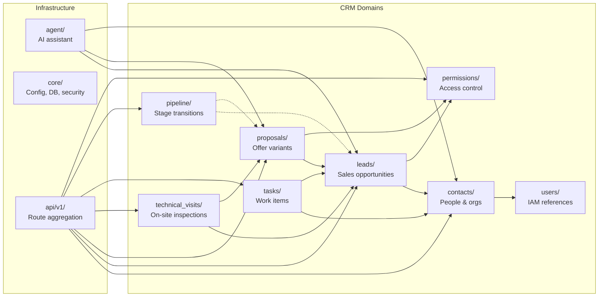

# Component Diagram

CRM domain structure and layer dependencies.



## Layer Dependency Rule

```
router.py  -->  service.py  -->  repository.py  -->  models.py
    |               ^
    v               |
 schemas.py    (may call other domain services)
```

- `router.py` only knows `service.py` and `schemas.py`. Never queries the DB directly.
- `service.py` orchestrates business logic, calls `repository.py`, may call other domain services.
- `repository.py` is the only layer that writes SQLModel/SQLAlchemy queries.
- `models.py` only imports from `sqlmodel` and Python builtins. No app-level imports.

## Domain Map


