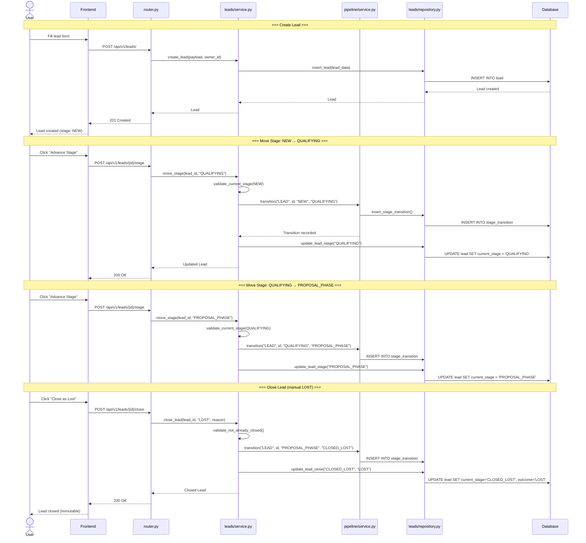

# Sequence Diagram: Lead Lifecycle

How a Lead progresses from creation through close.



## Stage Machine

```
NEW ──→ QUALIFYING ──→ PROPOSAL_PHASE ──→ CLOSED_WON  (via proposal won)
                                      └──→ CLOSED_LOST  (via all proposals lost, or manual close)
```

- Stages move forward only, no backward transitions
- Manual close is LOST-only (WON is reserved for proposal outcome)
- Closed leads are immutable (no update, no delete, no stage change)
