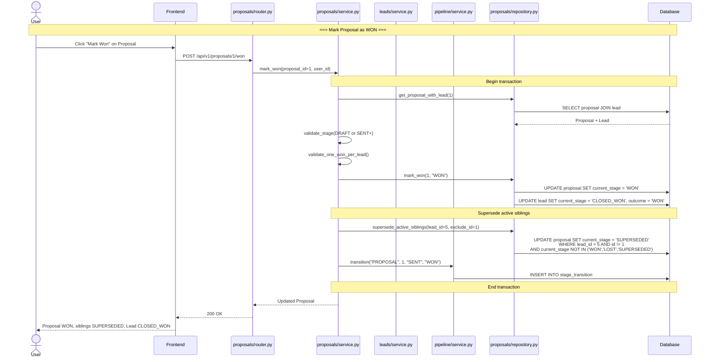

# Sequence Diagram: Proposal Win (Atomic Flow)

How marking a Proposal as WON triggers sibling superseding and Lead closure in a single transaction.



## Invariants Enforced

1. **One WON per Lead** — only one Proposal can be WON at a time
2. **Atomic win** — winning one Proposal auto-supersedes all active siblings in the same transaction
3. **Lead closes automatically** — the Lead transitions to CLOSED_WON when any Proposal wins
4. **SUPERSEDED is automatic** — never user-initiated, applied to all non-terminal siblings
5. **Loss reason mandatory** — when marking LOST, `loss_reason` is required

## Proposal Stage Machine

```
DRAFT ──→ SENT ──→ NEGOTIATION ──→ WON
                               └──→ LOST
                               └──→ SUPERSEDED (auto when sibling wins)
```
