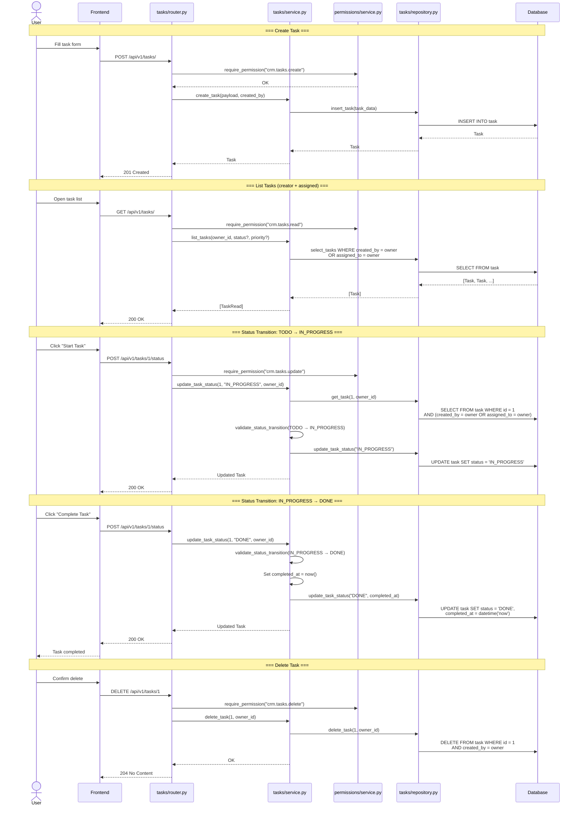

# Sequence Diagram: Task CRUD

Task creation, listing, status transitions, and deletion.



## Access Rules

- **List**: tasks where `created_by = current_user` OR `assigned_to = current_user`
- **Read**: same as list — creator or assignee can view
- **Update**: creator only (title, description, priority, due_date, assigned_to)
- **Status change**: creator only
- **Delete**: creator only

## Status Machine

```
TODO ──→ IN_PROGRESS ──→ DONE
   └──→ CANCELLED (any time before DONE)
```

- DONE and CANCELLED are terminal (no further transitions)
- `completed_at` is set automatically on DONE
